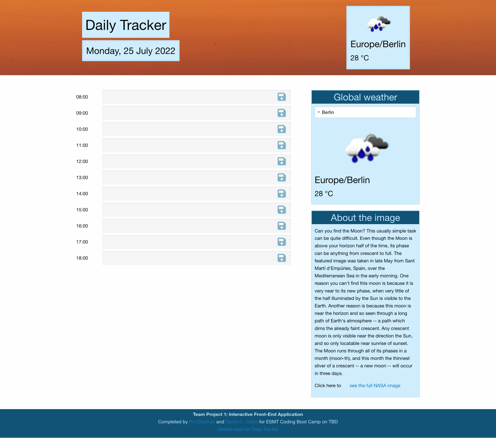

# Project 1: Daily Tracker
An assignment of the ESMT Coding Boot Camp to create an interactive front-end application.

**The challenge**: Working in a project team, use your collective skills in HTML, CSS, JavaScript, jQuery, and server-side APIs to develop a project from start (user story) to finish (deployed application). Key requirements: 
* Learn and apply a different CSS framework than Bootstrap
* Use two server-side APIs to retrieve select data for users
* Use client-side storage

**Our application**: We have created a simple daily tracker that allows the user to store hourly tasks on a personal web page that also displays the hour's weather information and the astronomy picture of the day. We use the [OpenWeather One Call API](https://openweathermap.org/api/one-call-api), the [NASA Astronomy Picture of the Day API](https://github.com/nasa/apod-api), and Luxon API for date/time tracking. We chose the [Foundation CSS Framework](https://get.foundation/) for design.

## Snapshot

## Special challenges
* Learning the Foundation CSS framework
* Understanding and using diverse server-side APIs, with and without SDKs

## Contact
**Pri Chauhan**  (@erog_tech)  
**Tammi L. Coles**  (@tlcoles)  
URL of deployed application:  https://erog-tech.github.io/daily-tracker/  
URL of the GitHub repository: https://github.com/erog-tech/daily-tracker  